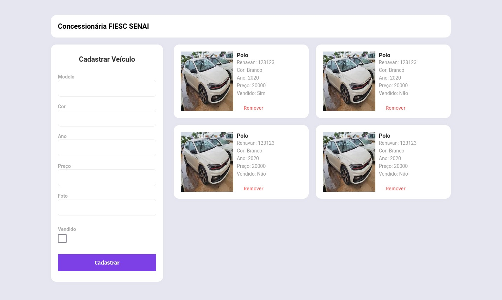

# Atividade Avaliativa II - Prática

- Curso - Desenvolvimento de Sistemas
- Unidade Curricular - Programação de Aplicativos
- Docente - Gustavo Roberto de Souza

## Orientações Gerais
- A avaliação deverá ser realizada individualmente.
- Não é permitido o uso do celular durante a realização da atividade.
- Conceitos de POO (Programação Orientado ao Objeto)
- A entrega deverá ser feita no AVA. Deve ser enviado apenas o link do repositório do github.

## Passo-a-Passo (Clonar e Entrega)
1. Você deve fazer um fork desse repositório, na parte superior dessa página clique na botão de fork. 
2. Depois disso, você deve clonar o repositório para o seu computador, usando o seguinte comando.
   1. Selecione uma pasta no computador.
   2. Abra o CMD (Terminal).
   3. Execute o seguinte comando `git clone <url_do_repositório>`
3. Abra no seu VS Code a pasta do projeto.
4. Desenvolva os exercícios.
5. Ao finalizar você precisa comittar e enviar novamente para o github suas modificações.
   1. Primeiro precisamos adicionar as alterações ao stage, usando o comando  `git add .`.
   2.  Depois disso, você vai de fato commitar, usando o comando `git commit -m "sua mensagem"`.
   3.  Por fim, você precisa fazer push para o github, com o comando `git push origin master`.
6. Por fim, você deve copiar o link do seu repositório e fazer o envio no AVA. 
   1. Você deve adicionar como comentário na entrega do AVA.

## Contexto
Você é responsável por desenvolver um sistema para uma revendedora de veículos. Nesse momento você deve desenvolver a página WEB, utilizando
HTML, CSS e Javascript. Você deve desenvolver um layout básico (como exemplo abaixo ou de sua preferência). Após finalizar a parte de layout,
deve adicionar uma funcionalidade, que é a de inserção de novos veículos. Ou seja, sempre que os dados forem preenchidos e o botão de cadastrar
for clicado, deve adicionar um novo veiculo a listagem. Fica como opcional o desenvolvimento da funcionalidade de deleção e utilização do localstorage.

> Lembre-se o foco não é ter um layout perfeito ou extremamente bonito, e sim um layout usual.

> Referente aos dados necessários, apenas Nome do Veículo, Ano e uma Imagem para ser mostrada.

> Dica: Foque em colocar os items em tela, inclusive com a utilização do Javascript e adição. Deixe o CSS para o final.

